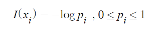
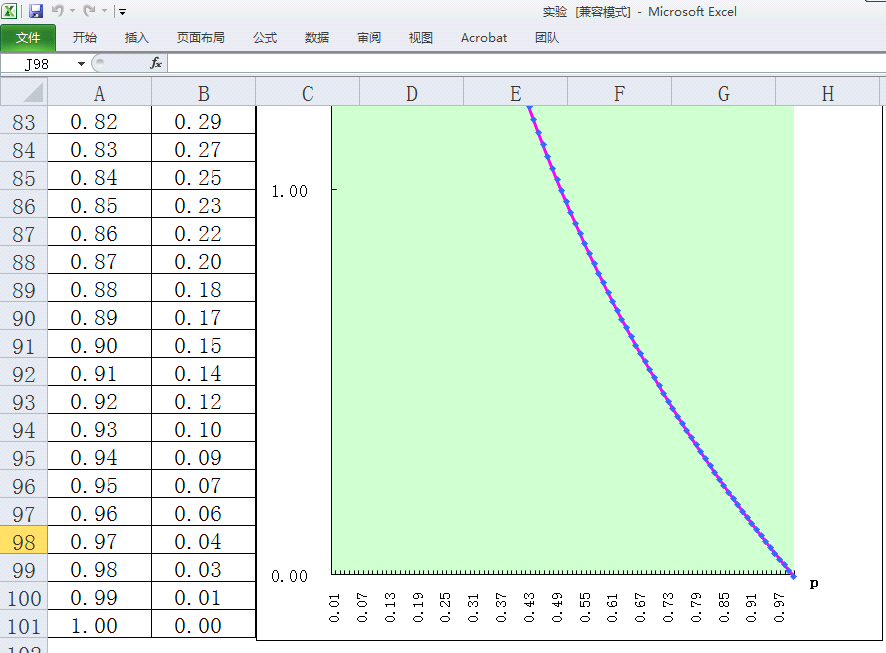
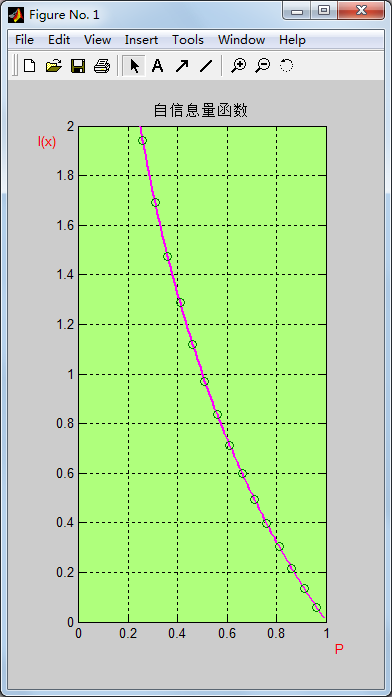

# 实验一、自信息量函数曲线绘制

## 一、实验内容

分别用 Excel 和 Matlab 软件绘制自信息函数曲线。

## 二、实验环境

1. 计算机
2. Windows 2000 或以上
3. Microsoft Office XP 或以上
4. Matlab 6.5 或以上

## 三、实验目的

1. 掌握 Excel 的数据填充、公式运算和图表制作
2. 掌握 Matlab 绘图函数
3. 掌握、理解自信息函数表达式及其性质

## 四、实验要求

1. 提前预习实验，认真阅读实验原理以及相应的参考书。
2. 认真高效的完成实验，实验中服从实验室管理人员以及实验指导老师的管理。
3. 认真填写实验报告。

## 五、实验原理
1. Excel 的图表功能（略）。
2. 自信息的概念及性质。

    

## 六、实验地址

- [自信息量函数曲线绘制](https://info-lab.wangding.in/labs/lab01.html)

## 七、实验结果

1. 在 Excel 中绘制的函数曲线图，请参考下图：

    

2. 在 Matlab 中绘制的函数曲线图，请参考下图：

    

