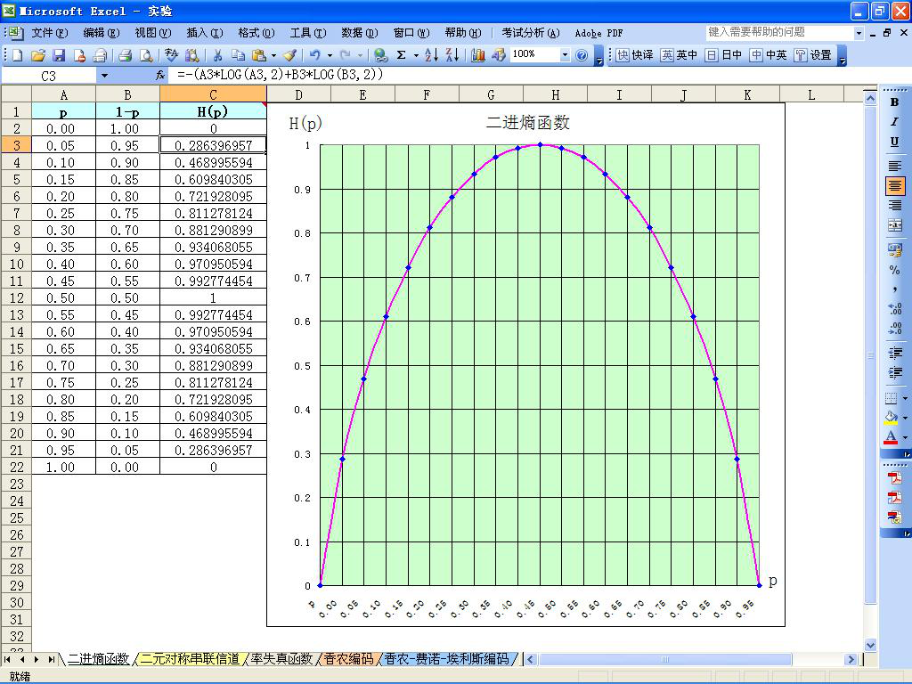
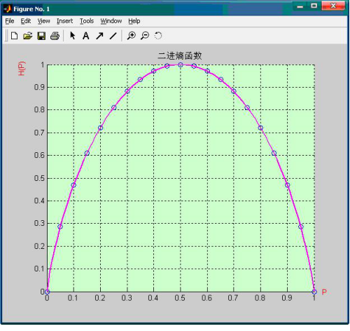
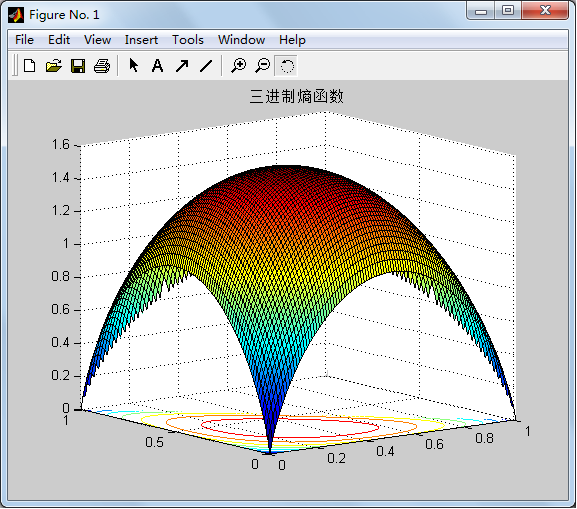

# 实验二、熵函数曲线绘制

## 实验内容

分别用 Excel 和 Matlab 软件绘制二进熵函数曲线。在 Matlab 软件中绘制三进熵函数曲面。

## 实验环境

1. 计算机
2. Windows 2000 或以上
3. Microsoft Office XP 或以上
4. Matlab 6.5 或以上

## 实验目的

1. 掌握 Excel 的数据填充、公式运算和图表制作
2. 掌握 Matlab 绘图函数
3. 掌握、理解熵函数表达式及其性质

## 实验要求

1. 提前预习实验，认真阅读实验原理以及相应的参考书。
2. 认真高效的完成实验，实验中服从实验室管理人员以及实验指导老师的管理。
3. 认真填写实验报告。

## 实验原理

1. Excel 的图表功能（略）。
2. 信源熵的概念及性质。

$$
\begin{bmatrix}
X \\
P(X)
\end{bmatrix}
 = \begin{Bmatrix}
 x_1 = 0 & x_2 = 1 \\
 p & 1-p
 \end{Bmatrix}
 , 0 \leqslant  p \leqslant 1
$$

$$
\begin{aligned}
H(X) &= -\sum_ip(x_i)logp(x_i) \\
     &= -[plogp+(1-p)log(1-p))] \\
     &= H(p)
\end{aligned}
$$

$$
\begin{aligned}
& a. H(X) \leqslant logn \\
& b. H[\lambda P + (1-\lambda)Q]\geqslant \lambda H(P)+(1-\lambda )H(Q)
\end{aligned}
$$

## 实验地址

- [熵函数曲线绘制](https://info-lab.wangding.in/labs/lab02.html)

## 实验结果

1. 在 Excel 中绘制的二进熵函数曲线图请参考下图。

  

2. 在 Matlab 中绘制的二进熵函数曲线图参考下图。

  

3. 在  Matlab 中绘制的三进熵函数曲面图参考下图。

  
