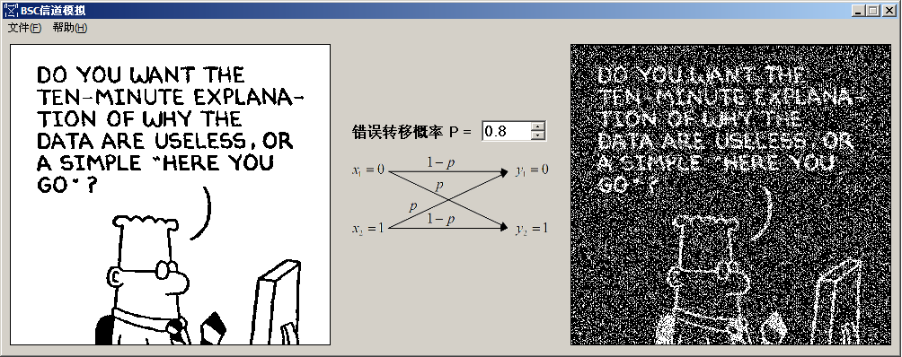

# 实验四、BSC 信道仿真

## 实验内容

用 BSC 信道仿真软件理解 BSC 信道中干扰对信道信息传输的影响。

## 实验环境

1. 计算机
2. Windows 2000 或以上
3. BSC 信道仿真软件

## 实验目的

掌握和理解 BSC 信道的特征。

## 实验要求

1. 提前预习实验，认真阅读实验原理以及相应的参考书。
2. 认真高效的完成实验，实验中服从实验室管理人员以及实验指导老师的管理。
3. 认真填写实验报告。

## 实验原理

略。

## 实验地址

- [BSC 信道仿真](https://info-lab.wangding.in/labs/lab04.html)
  
## 实验结果

1. 错误转移概率为 0.1 时，BSC 信道干扰情况，请参考下图。

  

2. 错误转移概率为 0.8 时，BSC 信道干扰情况，请参考下图。

  
