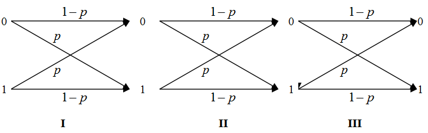
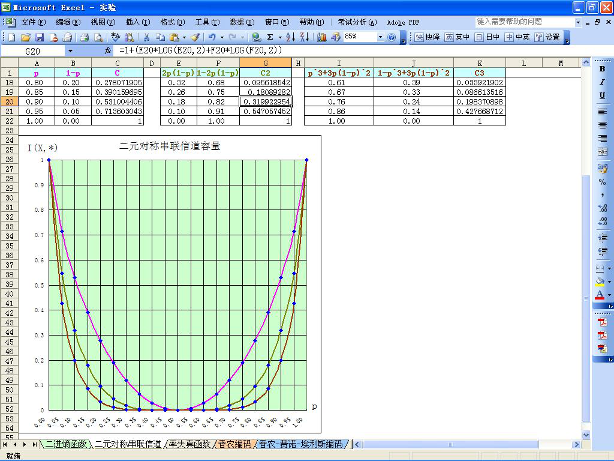
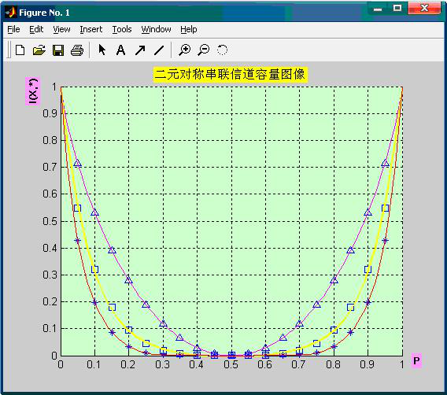

# 实验五、串联信道容量函数曲线绘制

## 实验内容

用 Excel 或 Matlab 制作串联信道容量曲线。

## 实验环境

1. 计算机
2. Windows 2000 或以上
3. Microsoft Office XP 或以上
4. Matlab 6.5 或以上

## 实验目的

1. 掌握 Excel 的数据填充、公式运算和图表制作
2. 掌握 Matlab 绘图函数
3. 掌握、理解串联信道的信道容量结论

## 实验要求

1. 提前预习实验，认真阅读实验原理以及相应的参考书。
2. 认真高效的完成实验，实验中服从实验室管理人员以及实验指导老师的管理。
3. 认真填写实验报告。

## 实验原理

Excel 的图表功能（略），串联信道的信道容量（下图）。参考《信息论——基础理论及应用》的 124 页。

| 串联 |  信道转移矩阵 |  信道容量  |
| :---: | ---------     | ---------- |
|   I    |  $$ [p(y/x)]=\begin{bmatrix} 1-p & p \\ p & 1-p  \end{bmatrix} $$    | $$ C_I = 1-H(p) $$  |
| I,II   | $$ \begin{aligned} [p(z/x)] &= [p(y/x)][p(z/y)] \\ &= \begin{bmatrix} 1-p & p \\ p   & 1-p  \end{bmatrix} \begin{bmatrix}  1-p & p \\  p  & 1-p  \end{bmatrix} \\  &= \begin{bmatrix}  (1-p)^2 + p^2 & 2p(1-p) \\  2p(1-p) & (1-p)^2 +p^2  \end{bmatrix}  \end{aligned} $$  |  $$ C_{I,II}=1-H[2p(1-p)] $$ |
| I,II,III | $$ \begin{aligned} [p(w/x)] &= [p(z/x)][p(w/z)] \\ &= \begin{bmatrix} (1-p)^2+p^2 & 2p(1-p) \\ 2p(1-p)   & (1-p)^2+p^2  \end{bmatrix} \begin{bmatrix}  1-p & p \\  p  & 1-p  \end{bmatrix} \\  &= \begin{bmatrix}  (1-p)^3 + 3p^2(1-p) & p^3+3p(1-p)^2 \\  p^3+3p(1-p)^2 & (1-p)^3 +3p^2(1-p)  \end{bmatrix}  \end{aligned} $$  | $$ C_{I,II,III}=1-H[p^3+3p(1-p)^2] $$ |

## 实验地址

- [串联信道容量曲线绘制](https://info-lab.wangding.in/labs/lab05.html)
  
## 实验结果

1. 在 Excel 中绘制的函数曲线图，请参考下图。

  

2. 在 Matlab 中绘制的函数曲线图，请参考下图。

  

