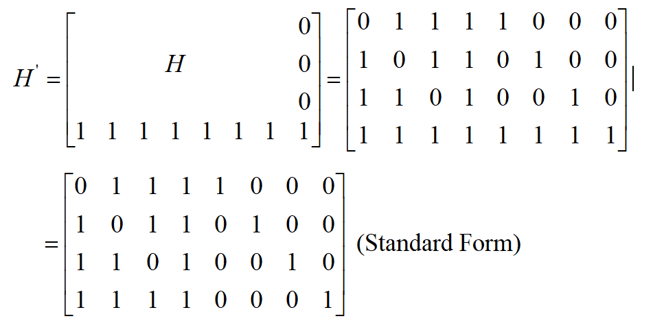

# 实验七、Hamming 编码

## 一、实验内容

编程实现线性分组码的信道编码和译码。

## 二、实验环境

1. 计算机
2. Windows 2000 或以上
3. Microsoft Office 2000 或以上
4. VC++ 6.0
5. MSDN 6.0

## 三、实验目的

1. 掌握线性分组码的编码和译码原理以及纠错原理
2. 掌握 VC++ 开发环境的使用（尤其是程序调试技巧）
3. 掌握 C 语言编程（尤其是位运算和文件的操作）

## 四、实验要求

1. 提前预习实验，认真阅读实验原理以及相应的参考书。
2. 认真高效的完成实验，实验中服从实验室管理人员以及实验指导老师的管理。
3. 认真填写实验报告。

## 五、实验原理

线性分组码的设计。

    (7,4) 汉明码的校验矩阵如下：
  

    (8,4) 线性分组码是对 (7,4) 汉明码的扩展，它的校验矩阵如下：

    (8,4) 线性分组码的生成矩阵如下：
    

    (8,4) 线性分组码的能够纠一位错误，并且检两位错误。

## 六、实验地址

- [Hamming 编码算法](https://info-lab.wangding.in/labs/lab07.html)
